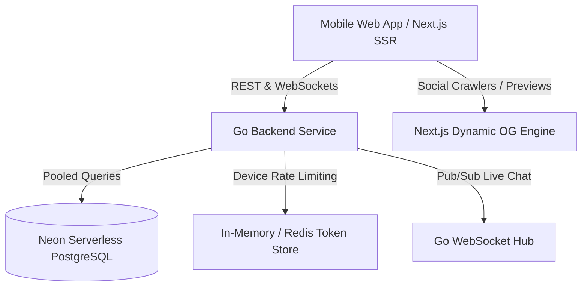

# BiggBossPulse (HousePulse) — Multi-Language Bigg Boss Fan Voting & Live Community

> **High-Performance Reality TV Fan Voting & Community Platform**  
> Covering **Bigg Boss Hindi, Telugu, Tamil, Kannada, Malayalam, Marathi & Bangla** with real-time fan polling, Monday-to-Friday nomination cycles, past weekly archives, and frictionless anonymous device chat.

---

## 🌟 Key Features

1. **Frictionless Anonymous Fan Voting:**
   - No forced Google OAuth or phone verification to cast a vote.
   - 1 vote per day per device with rate-limiting and anti-tamper device tokens.
   - Optional email linking for eviction notifications and account recovery.

2. **Real-time Live Chat & Discussions:**
   - Inline conversation room right below the voting ballot.
   - Instant 1-click anonymous device account generation with custom fan nicknames.
   - High-concurrency WebSockets powered by Go goroutines.

3. **TV Schedule Synchronization:**
   - Active voting opens Monday night post-nomination broadcast and locks Friday midnight.
   - Live real-time countdown timer before eviction episode.
   - Eviction outcome comparison: Community Fan Poll vs. Official Broadcaster result.

4. **Complete Historical Archive:**
   - Multi-week nomination history, voting percentage breakdowns, and eviction logs for all completed weeks.
   - Rich contestant profiles with native script names, photos, occupations, and survival stats.

5. **Mobile-First App-Like Experience:**
   - Optimized for mobile users (WhatsApp & Instagram social traffic).
   - Server-Side Rendered (SSR) Open Graph dynamic cards for rich WhatsApp previews.

---

## 🏗️ Architecture & Tech Stack



- **Frontend:** Next.js (React 19 / App Router), Vanilla CSS / Tailwind CSS, Lucide Icons
- **Backend:** Go (Golang) REST API + WebSockets (`gorilla/websocket`), connection pooling, graceful shutdown
- **Database:** Neon Serverless PostgreSQL with PgBouncer connection pooling
- **CI/CD:** GitHub Actions workflows for backend test/lint & frontend build

---

## 📂 Project Structure

```
BIGBOSS/
├── .github/
│   └── workflows/          # CI/CD Workflows for Go & Next.js
├── backend/                # Go Backend Service
│   ├── cmd/server/         # Entry point (main.go)
│   ├── internal/
│   │   ├── api/            # HTTP Handlers & Routes
│   │   ├── database/       # Neon Postgres connection & migrations
│   │   ├── models/         # Go data models (Show, Season, Week, Contestant, Vote, Chat)
│   │   ├── realtime/       # WebSocket Hub for live chat
│   │   └── service/        # Business logic & device vote limiting
│   └── migrations/         # PostgreSQL DDL migrations
├── frontend/               # Next.js Mobile-First Web Application
│   ├── app/                # App Router pages (Home, Shows, Vote, Archive)
│   ├── components/         # Reusable mobile UI components
│   └── lib/                # API client, device identity helpers
├── .env.example            # Environment configuration template
├── .gitignore              # Multi-tier ignore rules
└── README.md               # Project documentation
```

---

## 🚀 Getting Started

### Prerequisites
- Node.js 18+ & npm
- Go 1.22+
- Neon PostgreSQL account (or local Postgres)

### Quick Setup

1. **Clone the repository:**
   ```bash
   git clone https://github.com/your-username/biggboss-pulse.git
   cd biggboss-pulse
   ```

2. **Configure Environment:**
   ```bash
   cp .env.example .env
   # Edit .env with your Neon DATABASE_URL
   ```

3. **Run Backend (Go):**
   ```bash
   cd backend
   go run cmd/server/main.go
   ```

4. **Run Frontend (Next.js):**
   ```bash
   cd frontend
   npm install
   npm run dev
   ```

---

## 🛡️ License & Legal Disclaimer
*BiggBossPulse is an independent, non-commercial fan community platform. It is not affiliated with, endorsed by, or sponsored by Viacom18, JioCinema, Disney+ Hotstar, Endemol Shine, Banijay, or any official Bigg Boss broadcaster. All trademarks and contestant images belong to their respective owners.*
